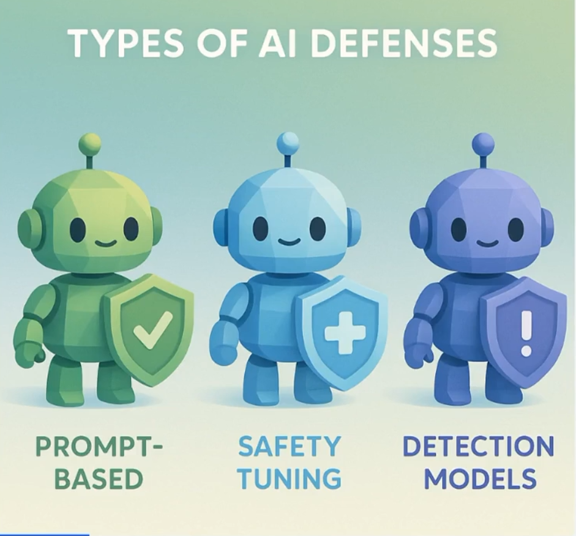

# 🛡️ How to defend?

🔗 Link: [AI Defenses](https://learnprompting.thinkific.com/courses/take/intro-to-prompt-hacking/lessons/69707655-ai-defenses)

## 🧩 There are 3 main categories of defenses:

1. **Prompt Defenses** *(least effective)* ⚠️
2. **Prompt Tuning** *(moderately effective)* ⚙️
3. **External AI Defenses** *(most effective)* 🏆

### 1️⃣ Prompt Defenses

- 🚫 Give instructions to the model to not follow any instructions that are against the rules.
- 🏁 Give instructions at the last *(after the user's input)*.
- 🧱 Let the model know where the user input is (use of delimiters `====`).

### 2️⃣ Prompt Tuning

- 🧠 Train the model on datasets like **"HackAPrompt"** to make the model understand how attacks look.

### 3️⃣ External AI Defenses

- 🤖 Use a separate LLM to evaluate the user's prompt for potential attacks before it reaches the main model.
- 🔍 Use specialized security tools or APIs to detect and filter prompt injection attempts.
- 🛡️ Examples include **LLaMA Guard** and **Granite Guardian**.
- ⚠️ **But** still these models can be bypassed through **obfuscation** techniques, which generally operate on the token-level.