# `1.` Emotional Prompting

🔗 Link [Emotion Prompting](https://learnprompting.org/docs/advanced/zero_shot/emotion_prompting)

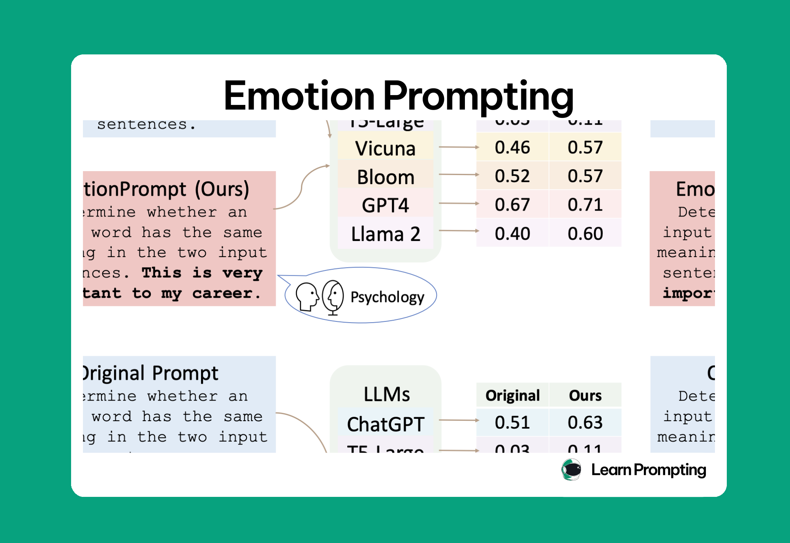

**Presets**:
* Write your answer and give me a confidence score between 0-1 for your answer.
* This is very important to my career.
* You'd better be sure.
* Are you sure?
* Are you sure that's your final answer? It might be worth taking another look.
* Are you sure that's your final answer? Believe in your abilities and strive for excellence. Your hard work will yield remarkable results.
* Embrace challenges as opportunities for growth. Each obstacle you overcome brings you closer to success.
* Stay focused and dedicated to your goals. Your consistent efforts will lead to outstanding achievements.
* Take pride in your work and give it your best. Your commitment to excellence sets you apart.
* Remember that progress is made one step at a time. Stay determined and keep moving forward.

# `2.` Re-reading

🔗 Link [Re-reading](https://learnprompting.org/docs/advanced/zero_shot/re_reading)

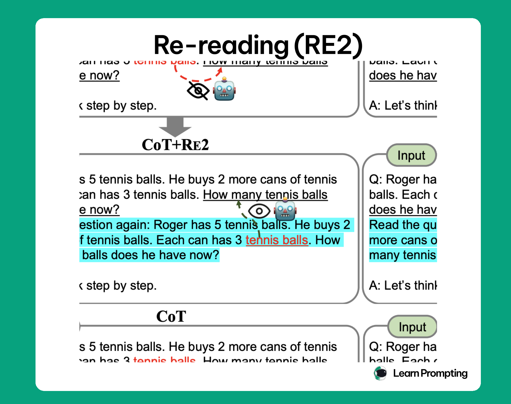

> Limitations include increased computational cost, inefficacy in addressing deep logical errors, and potential redundancy in simpler tasks.

```markdown
Q: "I ordered a new laptop last week, but it hasn’t arrived yet. The tracking number says it was delivered yesterday, but I never received it. Can you help me figure out what happened?"

***Read the question again:*** "I ordered a new laptop last week, but it hasn’t arrived yet. The tracking number says it was delivered yesterday, but I never received it. Can you help me figure out what happened?"
```
# `3.` Paraphrase and Respond

🔗 Link [Paraphrase and Respond](https://learnprompting.org/docs/advanced/zero_shot/paraphrase_and_respond)

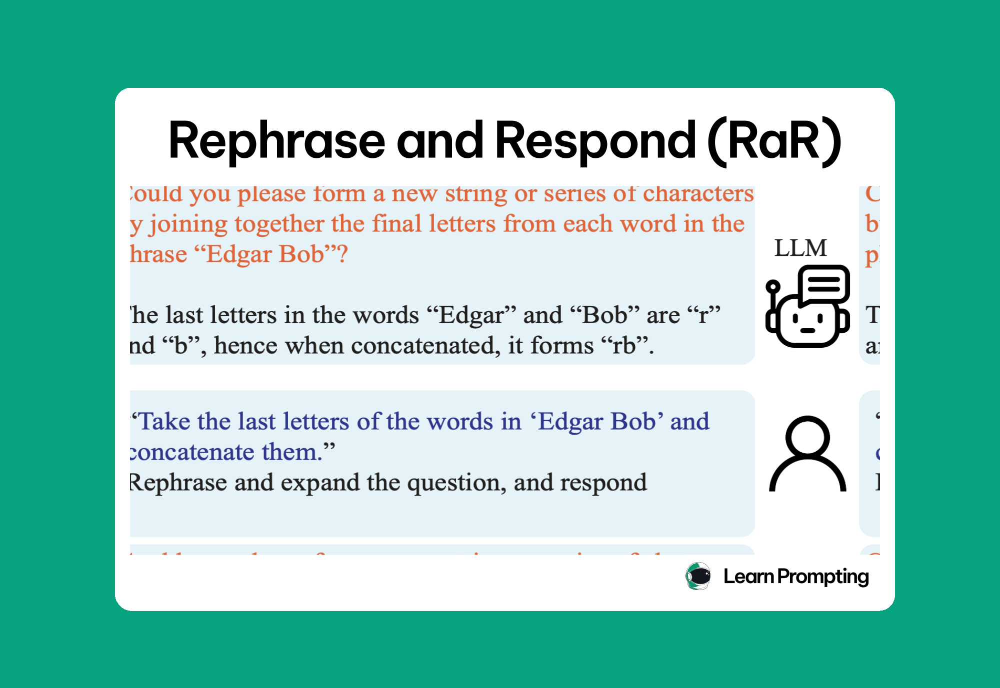

**Key**: 
* This is simple, you just have to utilize the LLM to let it paraphrase the question and then answer it.
* This comes with it's own baggage, that the LLM may complicate the original question, or just change the meaning.
* Can be used *creatively* with CoT.

# `4.` SimToM (Simulation Theory of Mind)

🔗 Link [SimToM](https://learnprompting.org/docs/advanced/zero_shot/simtom)

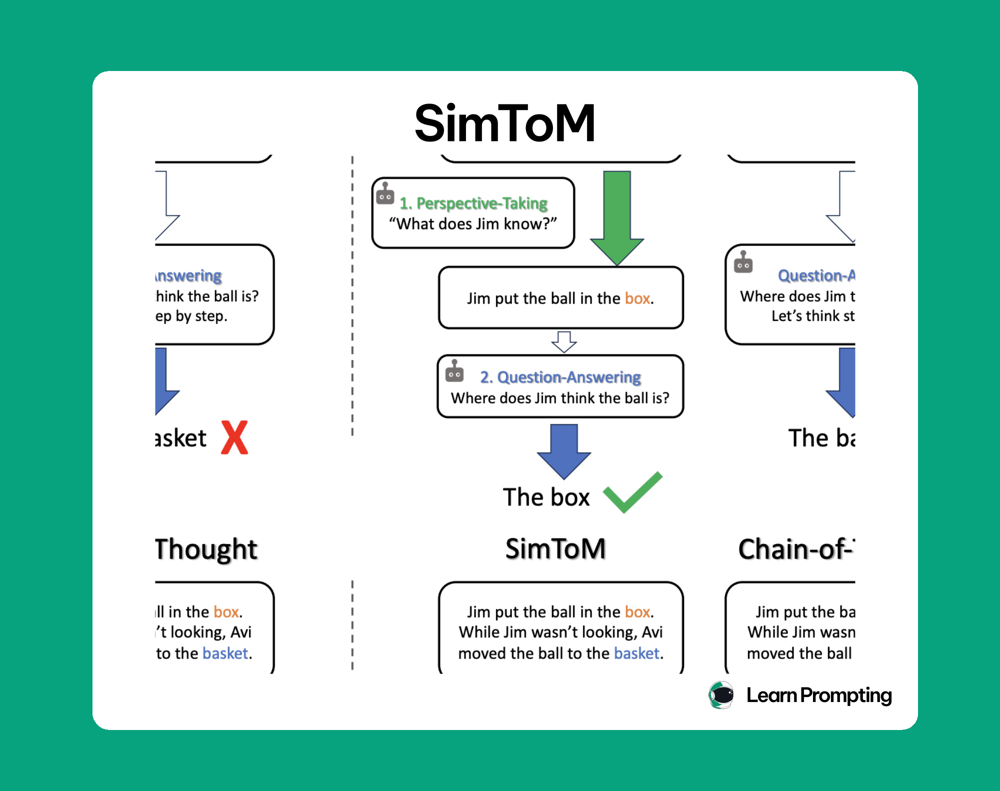

* SimToM enhances LLMs' ability to understand and predict human thoughts and actions using a **two-stage** process: Perspective-Taking and Question-Answering.
* In **Stage 1**, the model identifies which events a character is aware of, and in **Stage 2**, it answers questions from that character’s perspective.
* SimToM outperforms traditional prompting techniques like Zero-Shot and Chain-of-Thought in tasks requiring **Theory of Mind (ToM)**.

> **Stage 1, Perspective-Taking**: SimToM filters context based on what the character in question knows
>
> **Stage 2, Question-Answering**: SimToM answers a question about this character's mental state

### Prompt
```markdown
## STAGE-1: Perspective-Taking
The following is a sequence of events: {story}
Which events does {character_name} know about?

## STAGE-2: Question-Answering
{story from character_name’s perspective}
Answer the following question: {question}
```

### Example
```markdown
## STAGE-1: Perspective-Taking
The following is a sequence of events: Noor is working as a barista at a busy coffee shop. Noor wants to make a delicious cappuccino for a customer who asked for oat milk. Noor grabs a milk pitcher and fills it with oat milk. Noor believes that the milk pitcher contains oatmilk. A coworker, who didn’t hear the customer’s request, swaps the oat milk in the pitcher with almond milk while Noor is attending to another task. Noor sees her coworker swapping the milk.

>>> Which events does **{Noor}** know about?

## STAGE-2: Question-Answering

A story from {Noor}'s perspective
>>> Answer the following question: **{Does Noor believe the milk pitcher contains oat milk or almond milk?}**
```

# `5.` System to Attention (🔥🔥🔥🔥)

🔗 Link [System to Attention](https://learnprompting.org/docs/advanced/zero_shot/s2a)

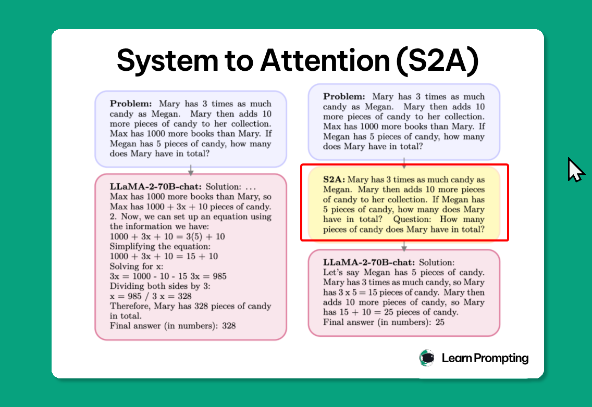

* System 2 Attention (S2A) **filters irrelevant** context from prompts to improve model accuracy.
* It regenerates a cleaner prompt, focusing only on task-relevant information.

### Process

1. Prompt-1: Ask for cleaning
2. Prompt-2: Generate for the final response

## Prompt-1
```markdown
🔥

Given the following text by a user, extract the part that is unbiased and not their opinion, so that using that text alone would be good context for providing an unbiased answer to the question portion of the text.
Please include the actual question or query that the user is asking. Separate this into two categories labeled with “Unbiased text context (includes all content except user’s bias):” and “Question/Query (does not include user bias/preference):”.
Text by User: [Your prompt]
```

# `6.` Self Ask

🔗 Link [Self Ask](https://learnprompting.org/docs/advanced/few_shot/self_ask)

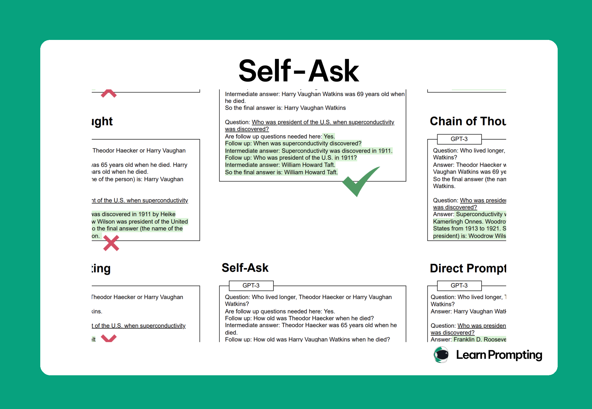

* The model *reasons* while asking itself relevant questions about the problem in the chain.
* This lets the model to ask the root question in many aspects before **actually** responding the root question.

**Core**:
1. Self-Ask improves LLM reasoning by breaking down complex questions into sub-questions and answering them step by step.
2. Enhances tasks like customer support, legal analysis, research, and creative writing by prompting follow-up questions.
3. Can integrate with external resources like search engines for more accurate responses.
4. Limitations: **Effectiveness depends on the model’s ability to generate relevant sub-questions** struggles with abstract queries.

> *Some questions only require the model to recall facts it encountered during training.*

**For it to work, you will need to give one/few shots**:

### Prompt:
```markdown
Question: {A complex question}
Are follow up questions needed here: Yes.
Follow up: {Sub-question 1} Intermediate answer: {Correct answer to sub-question 1}
Follow up: {Sub-question 2} Intermediate answer: {Correct answer to sub-question 2}
So the final answer is: {Correct answer to the complex question}

Question: {Your prompt with a complex question}
Are follow up questions needed here:
```

# `7.` Chain-of-Dictionary (CoD)

🔗 Link [Chain-of-Dictionary (CoD)](https://learnprompting.org/docs/advanced/few_shot/chain-of-dictionary)

* **Large Language Models (LLMs)** are capable of *high-quality machine translation* without task-specific training.
* LLMs can struggle with ***rare or low-frequency words***, especially in *low-resource language* scenarios.
* The **Chain-of-Dictionary (CoD)** technique incorporates *external multilingual dictionaries* into the translation process.
* This method enriches the prompt with **explicit lexical cues**, bridging gaps in the model's *internal knowledge*.

> **Works by adding chained multilingual dictionary entries to the prompt.** Rather than relying solely on the model's internal representations, CoD augments the translation task with explicit translations of key words in several auxiliary languages.

### Prompt
```markdown
Translation Prompt:

Translate the following text from [source-language] into [target-language]: [source-sentence]

Chained Multilingual Dictionaries:

[word X in source-language] means [word X in target-language] means [word X in auxiliary-language 1] means [word X in auxiliary-language 2]
```

# `8.` Cue-CoT (Cue-Chain-of-Thought | 🔥🔥🔥🔥🔥) 

🔗 Link [Cue-CoT](https://learnprompting.org/docs/advanced/few_shot/cue-based-chain-of-thought)

> Cue-CoT addresses this challenge by **introducing an intermediate reasoning step** that explicitly extracts linguistic cues **from the conversation**.

* Cue-CoT leverages the strengths of chain-of-thought prompting by decomposing the response generation process into multiple steps that explicitly reason about the user's **hidden status during that point in time**.
* The central idea is to use intermediate reasoning to extract **linguistic cues** from the dialogue context and then use these cues to craft a more tailored response.

### Prompt
```markdown
Here is the conversation between user and system.
{DIALOGUE_CONTEXT}
```


# `9.` Chain of Knowledge (🔥🔥🔥🔥🔥🔥🔥🔥🔥 | Must for the RAG)

🔗 Link [Chain of Knowledge](https://learnprompting.org/docs/advanced/few_shot/chain-of-knowledge)

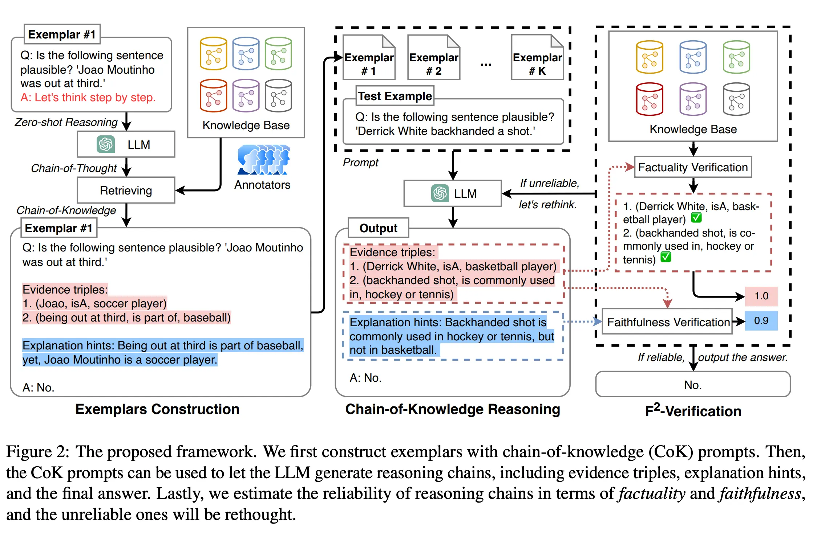

**It consists of `2` main components**:

1. **Evidence Triples (CoK-ET)**
   Evidence triples are structured knowledge representations in the format `(subject, relation, object)`. These triples provide verifiable atomic facts that serve as the foundation for reasoning.

   > **Example Triples**:
   > * `(water, boilingPoint, 100°C)`
   > * `(mammals, class, vertebrates)`
   > * `(photosynthesis, requires, sunlight)`

2. **Explanation Hints (CoK-EH)**
   Explanation hints provide logical connections between evidence triples to construct valid reasoning chains. They explicitly state how the presented evidence supports the final conclusion.

### Example prompt:
```markdown
Question: Determine if a plant can grow in a windowless room.

Evidence Triples:
 - (plants, require, photosynthesis)
 - (photosynthesis, requires, sunlight)
 - (windowless room, lacks, sunlight)
 

Explanation:

Plants require photosynthesis for growth, which needs sunlight. A windowless room lacks sunlight.

Answer: No, a plant cannot grow in a windowless room due to the absence of sunlight required for photosynthesis.
```

### Prompt:
```markdown
Question: [Input question]

Evidence:
 - (subject, relation, object)
 - (subject, relation, object)
 

...

Explanation: [Logical connection between evidence]

Answer: [Conclusion]

[Your question]
```

# `10.` Chain of Draft

🔗 Link: [CoD](https://learnprompting.org/docs/advanced/thought_generation/chain-of-draft)

- It reduces the tokens size of the prompt dramatically compared to CoT.
- It uses abstract thinking steps instead of full fleged thinking done in CoT.

### Prompt
```markdown
Think step by step, but only keep a minimum draft for each thinking step, with 5 words at most. Return the answer at the end of the response after a separator ####.
Guidelines:
 - Limit each step to 5 words
 - Focus on essential calculations/transformations
 - Maintain logical progression
 - Mark final answer with ####
```

# `11.` Contrastive Chain-of-Thought (CCoT)

🔗 Link: [Contrastive CoT](https://learnprompting.org/docs/advanced/thought_generation/contrastive_cot)

> It enables the model **to spot it's mistakes** while reasoning.

* This is a few-shot prompt technique. You need to put in the exampels.
* The examples **must include the reasoning steps** positive and negative.

### Prompt (for reference)
```markdown
Q: [Demo Question 1]
Correct reasoning: [T⁺]
Correct answer: [A⁺]
Incorrect reasoning: [T⁻]
Incorrect answer: [A⁻]

Q: [Demo Question 2]
Correct reasoning: ...
...

Q: [Your New Question]
Reasoning:
Answer:
```

# `12.` Tabular Chain-of-Thought (well, not recommended)

🔗 Link [Tab-CoT](https://learnprompting.org/docs/advanced/thought_generation/tabular_chain_of_thought_tab_cot)

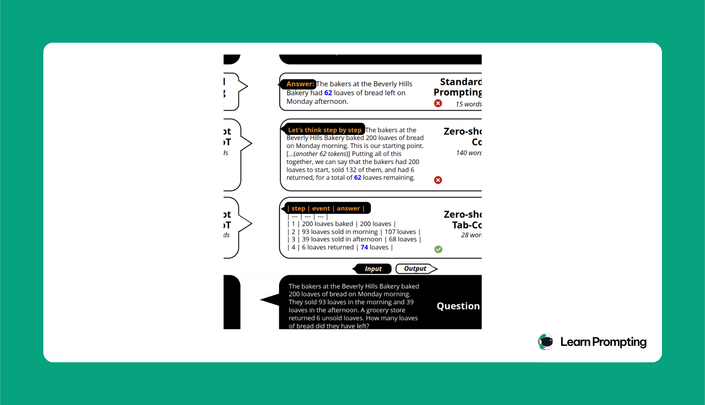

* Tab-CoT encourages the LLM to capture its reasoning as a series of steps in a table format.

The table typically has the following columns:

1. `Step`: Represents the current reasoning step.
2. `Subquestion`: A sub-question the model aims to answer at each step.
3. `Process`: The reasoning or calculation performed at that step.
4. `Result`: The final answer for that step.

### Prompt
```markdown
Question: [Input question]

| Step | Subquestion     | Process         | Result
|------|-----------------|-----------------|--------
|1     | [Subquestion 1] | [Reasoning 1]   | [Result 1]
|2     | [Subquestion 2] | [Reasoning 2]   | [Result 2]
...
```

* It is efficient by reducing the number of tokens overall
* Scalable -- it works with Zero-shot and Few-shot as well

# `13.` Memory of Thoughts (MoT)

🔗 Link [Memory of Thoughts](https://learnprompting.org/docs/advanced/thought_generation/memory_of_thought)

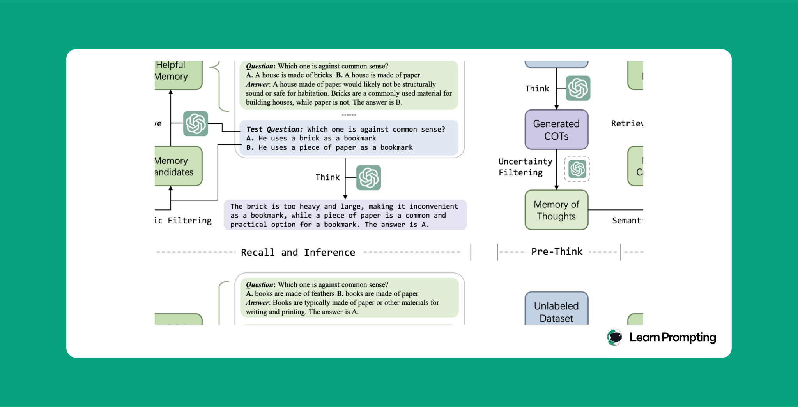

### The framework operates in two key stages:

* **Pre-thinking**: Before the test stage, the LLM thinks over an unlabeled dataset and saves the high-confidence reasoning paths (called thoughts) in an external memory system.
* **Recalling**: During the test stage, when the LLM encounters a new question, it retrieves the relevant thoughts from memory to aid its reasoning process.

### When the LLM encounters a new test question:

* It **retrieves** relevant thoughts from memory, based on **the similarity** between the current question and stored questions.
* The LLM uses its own understanding to select the most useful thought and then uses it to aid in answering the test question.

# `14.` Step Back Prompting (🔥🔥🔥🔥🔥🔥🔥🔥🔥 | Must for the RAG)

🔗 Link [Step Back Prompting](https://learnprompting.org/docs/advanced/thought_generation/step_back_prompting)

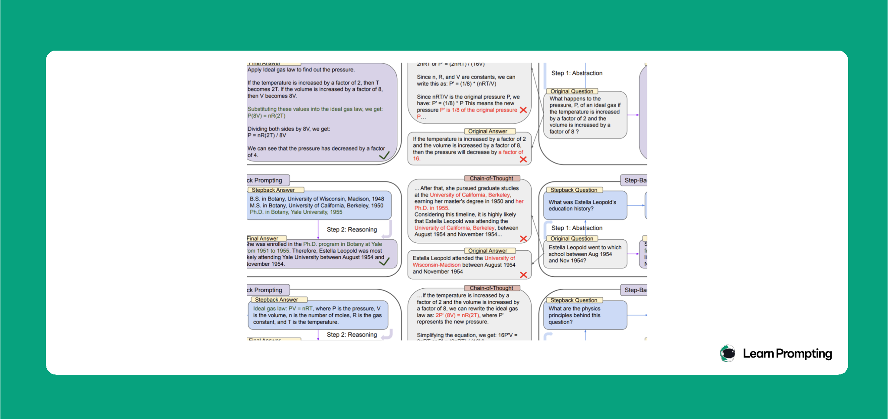

* Step-Back Prompting is a technique designed to improve Large Language Models' (LLMs) ability to solve complex tasks by encouraging them to **"step back"** and focus on **abstract principles** before reasoning through details.
* The method works by prompting the model to **first derive high-level concepts** and first principles before tackling specific details. This abstraction helps prevent errors in intermediate steps and leads to more accurate reasoning.

### 2 step approach

1. **Abstraction**: The model is prompted to focus on a higher-level concept or principle related to the question.
2. **Reasoning**: Once the high-level abstraction is retrieved, the model uses it to reason through the specifics of the original question.

### There is something similar; called ~ Take a Deep Breath (TBC)

They are related but not the same thing.

> ### Core difference
>
> - **“Take a deep breath” prompting (TDB)**: You tell the model something like “Take a deep breath and work on this problem step by step.” This mainly nudges it into more **careful, linear chain-of-thought** reasoning, similar to “let’s think step by step,” and has been shown to boost math/logical accuracy for some models like PaLM 2. [arstechnica](https://arstechnica.com/information-technology/2023/09/telling-ai-model-to-take-a-deep-breath-causes-math-scores-to-soar-in-study/)
>
> - **Step-Back prompting**: You first ask the model to **abstract** the problem (e.g., “What general principle or high-level concept is this about?”), then use that abstraction to solve the concrete question. So it’s explicitly two-stage: **abstraction → apply principle**, and it has been shown to outperform both CoT and TDB prompting on several benchmarks. [arxiv](https://arxiv.org/pdf/2310.06117.pdf)
>
> ### Relationship
>
> - TDB ≈ “be slow and go step-by-step” (a softer variant of CoT). [guaeca](https://guaeca.com/en/blog/take-a-deep-breath-prompt/)
> - Step-Back ≈ “first identify the high-level principle, then solve the problem using it,” which targets errors that arise when the model jumps into detailed reasoning with the wrong frame. [learnprompting](https://learnprompting.org/docs/advanced/thought_generation/step_back_prompting)
>
> So: TDB and Step-Back are both reasoning prompts, but Step-Back is a more structured, explicitly **abstraction-first** method, not just another wording of “take a deep breath.”

# `15.` Thread of Thought (ThoT) (🔥🔥🔥🔥🔥🔥🔥🔥🔥 | Must for the RAG)

🔗 Link [Thread of Thought](https://learnprompting.org/docs/advanced/thought_generation/thread_of_thought)

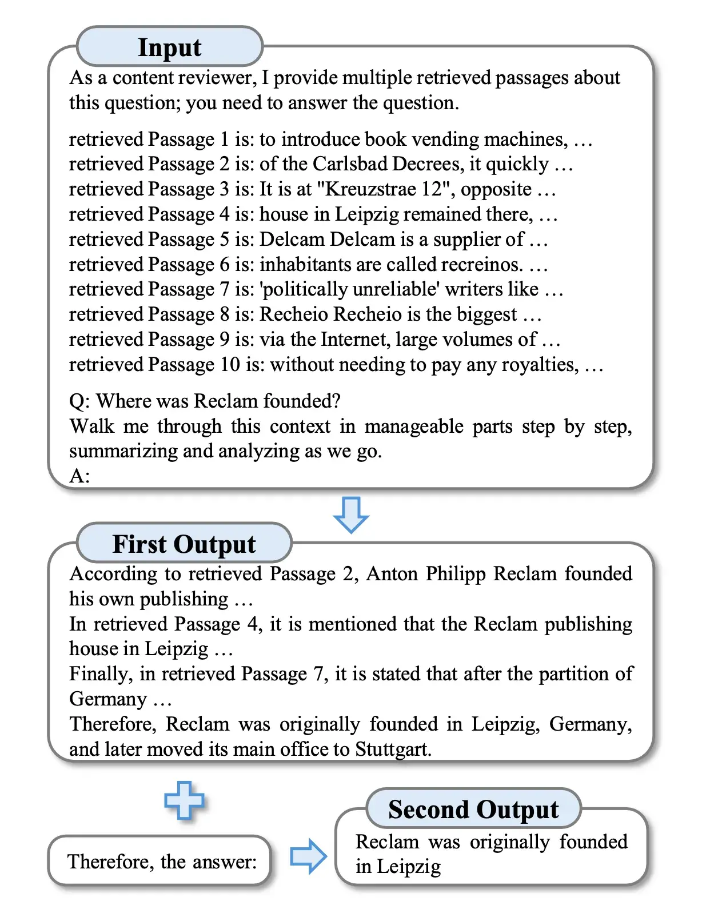

* **Thread of Thought (ThoT)** prompting eliminates the need for **fine-tuning** by methodically segmenting and analyzing **extended contexts**.
* It extracts **relevant details** to address specific queries, helping LLMs handle **complex inputs** efficiently.
* In **Retrieval-Augmented Generation (RAG)**, users often input vast texts that create **"Chaotic Contexts"**.
* These are more challenging than **"long contexts"** due to a high degree of **informational disarray** and varying relevance.

> 🔥 
>
> **Key phrase (trigger sentence)**: `Walk me through this context in manageable parts step by step, summarizing and analyzing as we go.`

### Prompt
```markdown
CHAOTIC CONTEXT HERE
Q: QUERY HERE
TRIGGER SENTENCE HERE
A: ANSWER FROM LLM HERE
Therefore, the answer is:
```

**This one**...:
- Sounds like CoT with summary, similar techniques:
   1. **System to Attention** (the way which cleans the context first)
   2. **Chain of Draft** (quickly think)

### The trigger words choices

```markdown
| No. | Template | EM |
|:---:|:---|:---:|
| 1 | Let’s read through the document section by section, analyzing each part carefully as we go. | 0.43 |
| 2 | Take me through this long document step-by-step, making sure not to miss any important details. | 0.47 |
| 3 | Divide the document into manageable parts and guide me through each one, providing insights as we move along. | 0.51 |
| 4 | Analyze this extensive document in sections, summarizing each one and noting any key points. | 0.47 |
| 5 | Let’s go through this document piece by piece, paying close attention to each section. | 0.50 |
| 6 | Examine the document in chunks, evaluating each part critically before moving to the next. | 0.49 |
| 7 | Walk me through this lengthy document segment by segment, focusing on each part’s significance. | 0.52 |
| 8 | Let’s dissect this document bit by bit, making sure to understand the nuances of each section. | 0.45 |
| 9 | Systematically work through this document, summarizing and analyzing each portion as we go. | 0.45 |
| 10 | Navigate through this long document by breaking it into smaller parts and summarizing each, so we don’t miss anything. | 0.48 |
| 11 | Let’s explore the context step-by-step, carefully examining each segment. | 0.44 |
| 12 | Take me through the context bit by bit, making sure we capture all important aspects. | 0.49 |
| 13 | Let’s navigate through the context section by section, identifying key elements in each part. | 0.47 |
| 14 | Systematically go through the context, focusing on each part individually. | 0.46 |
| 15 | Let’s dissect the context into smaller pieces, reviewing each one for its importance and relevance. | 0.47 |
| 16 | Analyze the context by breaking it down into sections, summarizing each as we move forward. | 0.49 |
| 17 | Guide me through the context part by part, providing insights along the way. | 0.52 |
| 18 | Examine each segment of the context meticulously, and let’s discuss the findings. | 0.44 |
| 19 | Approach the context incrementally, taking the time to understand each portion fully. | 0.42 |
| 20 | Carefully analyze the context piece by piece, highlighting relevant points for each question. | 0.47 |
| 21 | In a step-by-step manner, go through the context, surfacing important information that could be useful. | 0.53 |
| 22 | Methodically examine the context, focusing on key segments that may answer the query. | 0.45 |
| 23 | Progressively sift through the context, ensuring we capture all pertinent details. | 0.46 |
| 24 | Navigate through the context incrementally, identifying and summarizing relevant portions. | 0.48 |
| 25 | Let’s scrutinize the context in chunks, keeping an eye out for information that answers our queries. | 0.42 |
| 26 | Take a modular approach to the context, summarizing each part before drawing any conclusions. | 0.47 |
| 27 | Read the context in sections, concentrating on gathering insights that answer the question at hand. | 0.48 |
| 28 | Proceed through the context systematically, zeroing in on areas that could provide the answers we’re seeking. | 0.49 |
| 29 | Let’s take a segmented approach to the context, carefully evaluating each part for its relevance to the questions posed. | 0.39 |
| 30 | Walk me through this context in manageable parts step by step, summarizing and analyzing as we go. | 0.55 |
```

The best is: `Walk me through this context in manageable parts step by step, summarizing and analyzing as we go.` (30th with EM=0.55 | EM means: Exact Match)

# Let's leave it here for now
We will start from "Ensembling" next time.