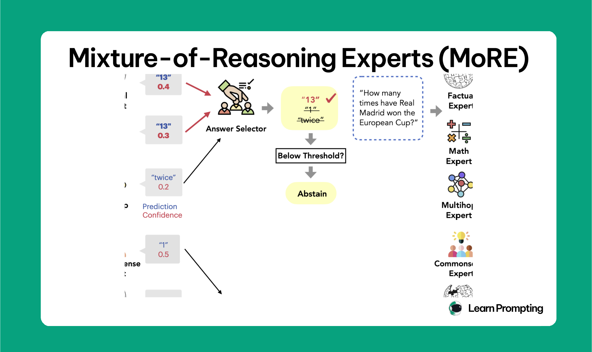
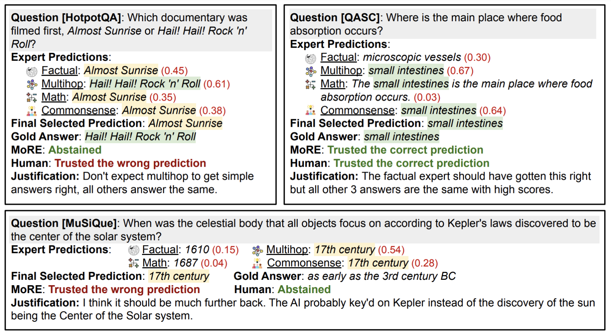
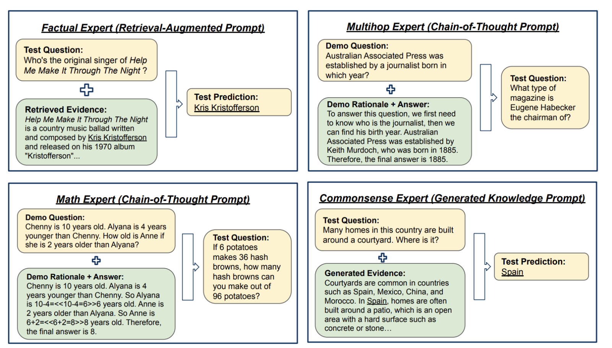
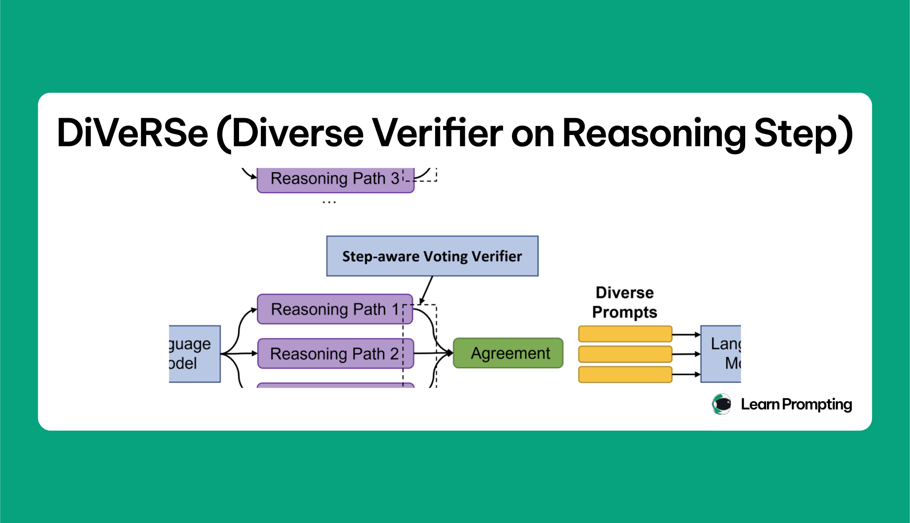

# 1️⃣ Ensembling

## `1.` Mixture of Reasoning Experts (MoRE)

🔗 Link [Mixture of Reasoning Experts (MoRE)](https://learnprompting.org/docs/advanced/ensembling/mixture_of_reasoning_experts_more)

> ***This technique uses different LLMs (differently prompted LLMs) which are expert in different things, and then combines their answers to get a better answer.***

### There are generaly differnt types, but to understand:

1. Factual reasoning (e.g., fact-based questions).
2. Multihop reasoning (e.g., questions that require multiple steps of reasoning).
3. Mathematical reasoning (e.g., solving math word problems).
4. Commonsense reasoning (e.g., questions requiring implicit knowledge).

> MoRE uses an **answer selector** to choose the best response based on predictions from the specialized experts.

> If the system detects that none of the answers are reliable, it can abstain from answering. Another key feature of MoRE is its ability to abstain from answering when it's unsure, improving the system's reliability.

### 🖼️ Visualizing the MoRE Architecture

1. **Expert Specialization & Reasoning**  
   

---

2. **Answer Selection & Final Output**  
   

# `2.` DiVerSe (Diverse Verification on Reasoning Steps)

🔗 Link [DiVerSe (Diverse Verification on Reasoning Steps)](https://learnprompting.org/docs/advanced/ensembling/diverse_verifier_on_reasoning_step)

#### What it is (1-liner)
- DiVeRSe = “Don’t trust one answer; generate multiple reasoning paths, score them with a verifier, verify steps, then pick the best via weighted voting **of the steps themselves**.”

#### Why you’d use it (real shit)
- LLMs screw up multi-step logic (math, invoices, rules, transformations), DiVeRSe reduces those dumb errors by competing multiple solutions and filtering.
- It gives you *diagnostics*: which step broke, not just “answer wrong.”

#### Components (remember these 3)
- Diverse prompts: different prompt templates force different reasoning paths.   
- Voting verifier: scores each full reasoning path as “likely correct,” then uses weighted voting instead of majority.
- Step-aware verification: checks each step independently to find where the chain goes wrong.

#### How it runs (chronological, per request)
1. Choose M1 prompt variants randomly for the same question/task.
2. For each prompt, sample M2 reasoning paths using sampling decoding (this is where randomness lives).
3. You now have $ (M = M1 \times M2 )$ candidate paths for the same question.
4. Run the voting verifier to score each path’s correctness probability.
5. Run step-aware verifier to check each step (subtraction, lookup, unit convert, etc.) and spot the failure step.
6. Do weighted voting using verifier scores to select the final answer.