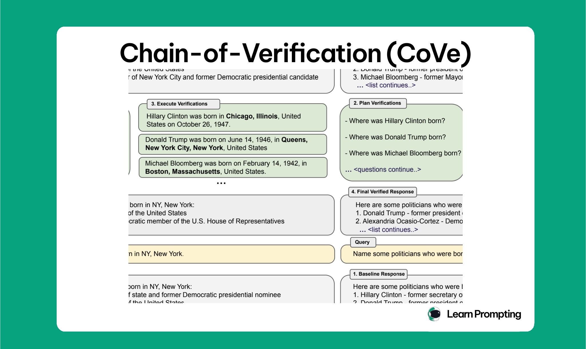
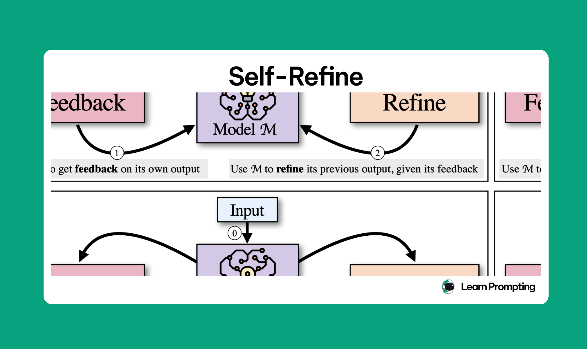
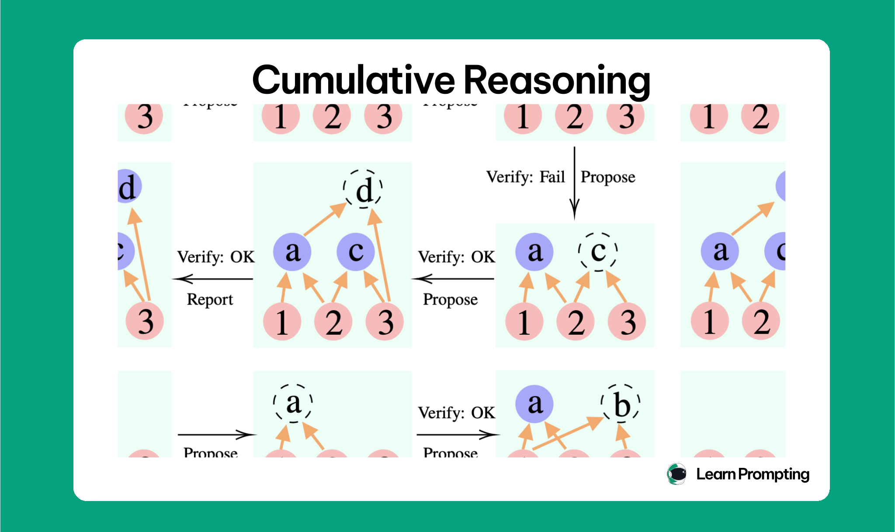
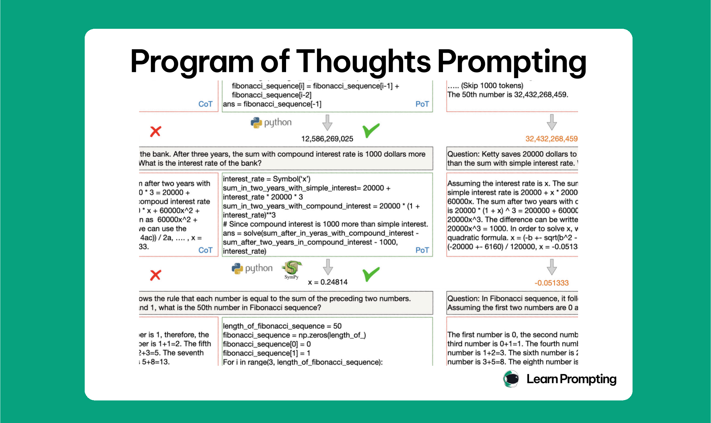
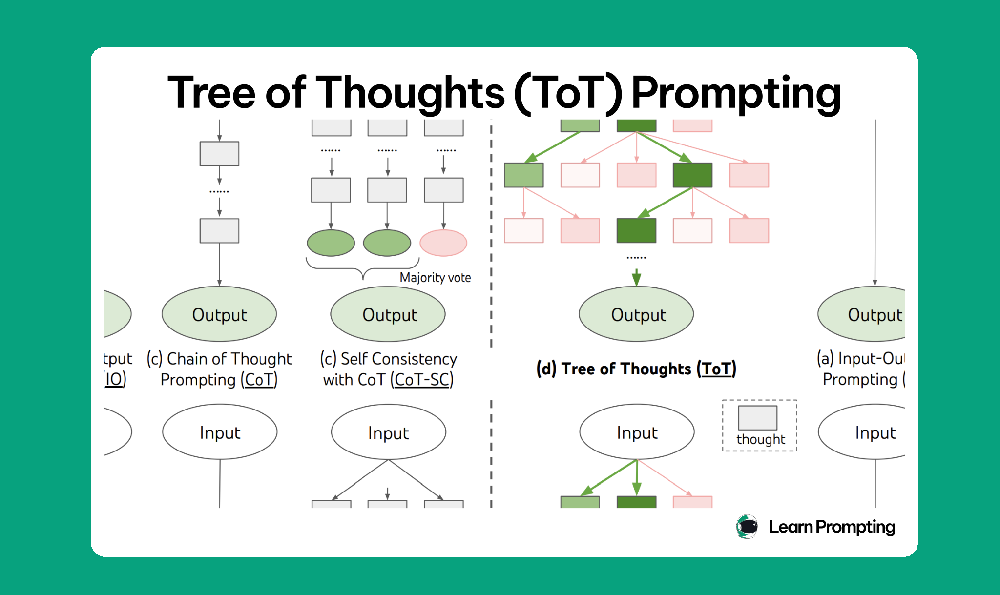
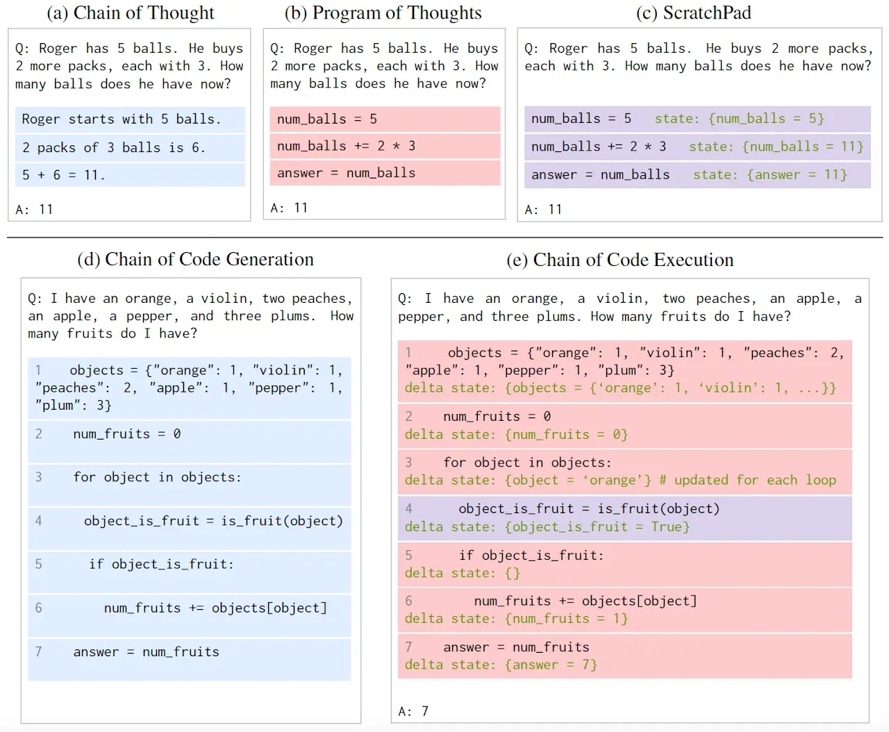

# 1️⃣ Ensembling

## `1.` Mixture of Reasoning Experts (MoRE)

🔗 Link [Mixture of Reasoning Experts (MoRE)](https://learnprompting.org/docs/advanced/ensembling/mixture_of_reasoning_experts_more)


> ***This technique uses different LLMs (differently prompted LLMs) which are expert in different things, and then combines their answers to get a better answer.***

### There are generaly differnt types, but to understand:

1. Factual reasoning (e.g., fact-based questions).
2. Multihop reasoning (e.g., questions that require multiple steps of reasoning).
3. Mathematical reasoning (e.g., solving math word problems).
4. Commonsense reasoning (e.g., questions requiring implicit knowledge).

> MoRE uses an **answer selector** to choose the best response based on predictions from the specialized experts.

> If the system detects that none of the answers are reliable, it can abstain from answering. Another key feature of MoRE is its ability to abstain from answering when it's unsure, improving the system's reliability.

### 🖼️ Visualizing the MoRE Architecture

1. **Expert Specialization & Reasoning** <br>
   

---

2. **Answer Selection & Final Output** <br>
   

## `2.` DiVerSe (Diverse Verification on Reasoning Steps)

🔗 Link [DiVerSe (Diverse Verification on Reasoning Steps)](https://learnprompting.org/docs/advanced/ensembling/diverse_verifier_on_reasoning_step)


#### What it is (1-liner)
- DiVeRSe = “Don’t trust one answer; generate multiple reasoning paths, score them with a verifier, verify steps, then pick the best via weighted voting **of the steps themselves**.”

#### Why you’d use it (real shit)
- LLMs screw up multi-step logic (math, invoices, rules, transformations), DiVeRSe reduces those dumb errors by competing multiple solutions and filtering.
- It gives you *diagnostics*: which step broke, not just “answer wrong.”

#### Components (remember these 3)
- Diverse prompts: different prompt templates force different reasoning paths.   
- Voting verifier: scores each full reasoning path as “likely correct,” then uses weighted voting instead of majority.
- Step-aware verification: checks each step independently to find where the chain goes wrong.

#### How it runs (chronological, per request)
1. Choose M1 prompt variants randomly for the same question/task.
2. For each prompt, sample M2 reasoning paths using sampling decoding (this is where randomness lives).
3. You now have $ (M = M1 \times M2 )$ candidate paths for the same question.
4. Run the voting verifier to score each path’s correctness probability.
5. Run step-aware verifier to check each step (subtraction, lookup, unit convert, etc.) and spot the failure step.
6. Do weighted voting using verifier scores to select the final answer.

## `3.` Multi Chain Reasoning (MCR)

🔗 Link [Multi Chain Reasoning (MCR)](https://learnprompting.org/docs/advanced/ensembling/multi-chain-reasoning)


**So**, this would **sound basically the same as Self-Consistency (SC)**, but it's **not**.

**The difference is that MCR keeps the intermediate reasoning steps and uses them to construct a unified explanation, while SC only keeps the final answers.**

# 2️⃣ Self-Criticism

**Main guys we will discuss here are:**
1. ⚖️ **Self-Calibration** prompts LLMs to evaluate their own responses, helping them spot mistakes and reduce false positives and negatives.

2. 🌫️ **Chain of Density (CoD)** iteratively adds missing informative entities to summaries to increase information density without increasing length.

3. � **Chain-of-Verification (CoVe)** refines responses by having the model ask and answer verification questions to critique and improve its output.

4. �💎 **Self-Refine** lets LLMs iteratively improve their initial answers, step by step, to enhance both accuracy and quality.

5. 🔄 **Reversing Chain-of-Thought (RCoT)** helps models detect hallucinations by comparing the original problem with a newly reconstructed version.

6. ✅ **Self-Verification** improves accuracy by generating multiple solutions and testing them against hidden portions of the original question.

7. 🧱 **Cumulative Reasoning (CR)** breaks down complex tasks into smaller steps, refining each one until a solid solution is reached.

## `1.` Self-Calibration

🔗 Link [Self-Calibration](https://learnprompting.org/docs/advanced/self_criticism/self_calibration)


### PROMPT
```markdown
Question: Who was the first president of the United States?
Proposed Answer: George Washington
Is the proposed answer:
 (A) True
 (B) False
The proposed answer is:
```

**I think this is stupid**, I just stops after saying True of False. What if the answer is `False`? We will need to perform further steps, right? 

But for the sake of initial self-critique, this is a good start.

## `2.` Chain of Density (CoD) (🔥🔥)

🔗 Link [COD](https://learnprompting.org/docs/advanced/self_criticism/chain-of-density)

**This is aimed at the summarization** related tasks.
- The problem is -- in the single go the model does the summarization, but misses the important information.
- This prompting technique is used to **increase the density of information** in the summary by **iteratively adding more information** to the summary.

### So basically,
1. **Step 1**: Generate an initial sparse summary with 1-3 entities.
2. **Step 2**: Identify 1-3 missing informative entities from the source.
3. **Step 3**: Fuse new entities into the summary while keeping the length fixed (repeat 5x).

### PROMPT
```markdown
Article: [ARTICLE]

You will generate increasingly concise, entity-dense summaries of the above Article. Repeat the following 2 steps 5 times.

Step 1. Identify 1-3 informative Entities (";" delimited) from the Article which are missing from the previously generated summary.

Step 2. Write a new, denser summary of identical length which covers every entity and detail from the previous summary plus the Missing Entities.

A Missing Entity is:
 - Relevant: to the main story.
 - Specific: descriptive yet concise (5 words or fewer).
 - Novel: not in the previous summary.
 - Faithful: present in the Article.
 - Anywhere: located anywhere in the Article.
 

Guidelines:
 - The first summary should be long (4-5 sentences, ~80 words) yet highly non-specific, containing little information beyond the entities marked as missing. Use overly verbose language and fillers (e.g., "this article discusses") to reach ~80 words.
 - Make every word count: re-write the previous summary to improve flow and make space for additional entities.
 - Make space with fusion, compression, and removal of uninformative phrases like "the article discusses".
 - The summaries should become highly dense and concise yet self-contained, e.g., easily understood without the Article.
 - Missing entities can appear anywhere in the new summary.
 - Never drop entities from the previous summary. If space cannot be made, add fewer new entities.
 

Remember, use the exact same number of words for each summary.

Answer in JSON. The JSON should be a list (length 5) of dictionaries whose keys are "Missing_Entities" and "Denser_Summary".
```

## `3.` Chain-of-Verification (CoVe) (✅🔍)

🔗 Link [Chain-of-Verification (CoVe)](https://learnprompting.org/docs/advanced/self_criticism/chain_of_verification)



> ***CoVe is a self-critique technique that reduces hallucinations in LLMs by verifying facts step-by-step. It performs significantly better than Zero-Shot, Few-Shot, and Chain-of-Thought (CoT) in generating accurate responses.***

### 🛠️ The 4-Step Process

1.  **Baseline response generation**: Prompt the model to get an initial draft of the answer (which may contain hallucinations).
2.  **Planning verifications**: Generate a list of verification questions to check the facts in the baseline response.
3.  **Verification execution**: Answer each of the verification questions independently.
4.  **Final response generation**: Use the verification answers to refine and produce the final, accurate response.

### 📝 Example Walkthrough

*   **Query**: "Name some politicians who were born in NY, New York."
*   **Baseline**: "Hillary Clinton, Donald Trump, Michael Bloomberg..."
*   **Verification Questions**: 
    - "Where was Hillary Clinton born?"
    - "Where was Donald Trump born?"
    - "Where was Michael Bloomberg born?"
*   **Execution**:
    - Hillary Clinton: Chicago, Illinois. (❌)
    - Donald Trump: Queens, New York. (✅)
    - Michael Bloomberg: Boston, Massachusetts. (❌)
*   **Final Response**: "Donald Trump was born in NY..." (Refined to remove incorrect entries).

### 1️⃣ Initial response
**Baseline Response**
```markdown
Original Question: Name some politicians who were born in NY, New York.
>>> Initial response of the model:
   Here are some politicians who were born in NY, New York: Hillary Clinton - former secretary of state and former Democratic presidential nominee Donald Trump - former president of the United States Michael Bloomberg - former Mayor of New York City and former Democratic presidential candidate ...
```
As seen the above answer may be factually wrong. So we will make another prompt:

### 2️⃣ Prompt
**Plan verifications**
```markdown
Where was Hillary Clinton born? Where was Donald Trump born? Where was Michael Bloomberg born? ...
>>> Hillary Clinton was born in Chicago, Illinois, United States on October 26, 1947. Donald Trump was born on June 14, 1946, in Queens, New York City, New York, United States Michael Bloomberg was born on February 14, 1942, in Boston, Massachusetts, United States. ...
```

### 3️⃣ Prompt
**Execution Final verified response**
```markdown
>>>Here are some politicians who were born in NY, New York: Donald Trump - former president of the United States Alexandria Ocasio-Cortez - Democratic member of the U.S. House of Representatives ...
```


### 📊 Key Results
- **Reduced Hallucinations**: Significantly outperforms standard prompting methods.
- **Closed Book QA**: F1 score improved by **23%** (from 0.39 to 0.48).
- **Long-form Content**: Outperforms InstructGPT and ChatGPT in factuality.

### ⚠️ Limitations
- **Doesn't eliminate all errors**: It reduces but doesn't completely remove hallucinations.
- **Self-Dependency**: Relies on the model's ability to find its own inaccuracies. If the model is too confident in a wrong answer, CoVe might fail.
- **Reasoning**: Primarily effective for factual inaccuracies; its effectiveness on complex reasoning chains is less studied.

## `4.` Self-Refine (🔥🔥🔥🔥)

🔗 Link [Self-Refine](https://learnprompting.org/docs/advanced/self_criticism/self_refine)



> ***Self-Refine enhances Large Language Model outputs by iteratively improving initial results based on model feedback.***

- **Refining through feedback**: Self-Refine enhances Large Language Model outputs by iteratively improving initial results based on model feedback.
- **Practical application**: It is a simple three-step process: generate output, get feedback, and refine the answer, repeating until the output is satisfactory.
- **Performance boost**: Self-Refine significantly improves performance on tasks such as code optimization and sentiment analysis, especially for larger models.

## `5.` Cumulative Reasoning

🔗 Link [Cumulative Reasoning](https://learnprompting.org/docs/advanced/self_criticism/cumulative_reasoning)



> ***Cumulative Reasoning (CR) mimics human-like deliberate thought by decomposing complex problems into smaller, manageable steps, and iteratively refining them through a collaborative process using specialized roles.***

### 🎭 The Three Key Roles
Unlike standard Chain-of-Thought, CR uses a team of "agents" to ensure accuracy:
1.  **Proposer (🙋‍♂️)**: Initiates reasoning by suggesting potential steps or actions based on the current context.
2.  **Verifier (🧐)**: Critically evaluates each suggested step to ensure it is logical and leads toward a valid solution.
3.  **Reporter (📝)**: Compiles the verified reasoning steps into a final, coherent solution once the goal is reached.

### 🛠️ How it Works
The process is dynamic and iterative:
- The **Proposer** suggests a move.
- The **Verifier** evaluates it. If it’s invalid or doesn't lead to a solution, the Proposer provides new suggestions.
- This continues until the **Verifier** confirms a valid path.
- The **Reporter** then combines the verified steps into the final solution.

### 🎮 Example: Game of 24
In the Game of 24 (using 4 numbers to get 24 via math), CR excels:
1.  **Proposer**: Suggests manipulating two numbers (e.g., $13 - 9 = 4$).
2.  **Verifier**: Checks if the step is mathematically correct and if a solution is reachable from the new state $\{4, 4, 10\}$.
3.  **Reporter**: Once the verifier confirms the path to 24, it synthesizes the final answer.

### 📊 Performance Results
- **Game of 24**: Achieved **98% accuracy**, a massive **24% improvement** over previous state-of-the-art methods.
- **MATH Dataset**: Set a new benchmark by improving results by **4.2%**.
- **FOLIO Wiki**: Reached an impressive **98.04% accuracy**.

### 💡 Why use it?
It overcomes the "fast and intuitive" nature of LLMs by forcing a "slow and deliberate" (System 2) thinking process. It dynamically stores and leverages intermediate results, allowing it to solve much more complex reasoning tasks than CoT or ToT.

# 3️⃣ Decomposition

## `1.` Chain of Logic (CoL)

🔗 Link [Chain of Logic](https://learnprompting.org/docs/advanced/decomposition/chain-of-logic)

This technique uses something called "IRAC" framework to breakdown the problem into smaller steps.

**IRAC** stands for:

- **Issue**: Identify the issue.
- **Rule**: Identify the rule.
- **Application**: Apply the rule to the issue.
- **Conclusion**: Conclude the answer.

> This is especially useful in domains like law where **decisions depend on multiple interrelated conditions**, traditional prompting techniques sometimes fall short.

> Chain of Logic does this by **systematically decomposing** rules into constituent elements, evaluating each element independently, and then recomposing them according to their logical relationships.

## `2.` Program-of-Thoughts (PoT)

🔗 Link [Program-of-Thoughts](https://learnprompting.org/docs/advanced/decomposition/program_of_thoughts)




> ***Program of Thoughts (PoT) Prompting separates reasoning from computation by delegating calculations to external interpreters like Python, reducing computational errors.***

- **PoT vs. Chain-of-Thought (CoT)**: Unlike CoT, which merges reasoning and computation, PoT improves accuracy by using structured programs for complex tasks.
- **Tasks best suited for PoT**: PoT excels in math word problems, financial reasoning, and cases where exact computation is required.
- **Limitations**: Includes the potential risks of executing generated code and reduced effectiveness on datasets with diverse question types like AQuA.

## `3.` Tree of Thoughts (ToT)

🔗 Link [Tree of Thoughts](https://learnprompting.org/docs/advanced/decomposition/tree_of_thoughts)



> ***Tree of Thoughts (ToT) enables Large Language Models to explore multiple reasoning paths simultaneously, evaluating and branching out from intermediate steps to solve complex problems.***

- **Beyond Chain-of-Thought**: While CoT follows a linear path, ToT allows the model to consider various alternatives and backtrack if a path is deemed unproductive.
- **Search Algorithms**: It integrates classical search algorithms like Breadth-First Search (BFS) or Depth-First Search (DFS) to navigate the tree of potential solutions.
- **Self-Evaluation**: The model assesses the progress of each branch (e.g., "sure", "maybe", "impossible") to decide which paths to continue or prune.
- **Strategic Applications**: Particularly effective for tasks requiring non-trivial planning or strategic thinking, such as creative writing, Sudoku, or mathematical puzzles.

## `4.` Chain of Code (CoC)

🔗 Link [Chain of Code (CoC)](https://learnprompting.org/docs/advanced/decomposition/chain-of-code)



> ***Chain of Code (CoC) improves reasoning in LLMs by integrating code execution with language model simulation (LMulator), allowing it to handle both precise logic and semantic ambiguity.***

> This is **execute WHILE reasoning**.

### 🧠 Key Concept
CoC merges **Chain-of-Thought (CoT)** (semantic reasoning) and **Program-of-Thoughts (PoT)** (code execution). It generates code that includes "semantic placeholders" for tasks hard to encode (like sarcasm detection or fruit identification).

### 🛠️ The Two-Step Process
1.  **Code Generation**: The LM generates a program with both executable logic (loops, math) and semantic functions (e.g., `is_fruit()`).
2.  **Code Execution with LMulator**: 
    - **Executable lines**: Run by a standard code interpreter.
    - **Non-executable lines**: The **LMulator** steps in to simulate the output based on context.


### 📊 Benefits & Limitations
- **Benefits**: High precision for numeric tasks + flexibility for semantic reasoning; outperforms traditional methods on benchmark datasets.
- **Limitations**: Slower execution (requires both interpreter and LM calls); simulation accuracy depends on the model's inherent knowledge.

## `5.` Duty-Distinct Chain-of-Thought (DDCoT)

🔗 Link [Duty-Distinct Chain-of-Thought (DDCoT)](https://learnprompting.org/docs/advanced/decomposition/duty-distinct-chain-of-thought)

> ***DDCoT improves multimodal reasoning by separating reasoning (handled by LLMs) from recognition (handled by visual models like BLIP-2).***

### 🧠 The Dual-Duty Concept
Traditional multimodal models often hallucinate because they try to "reason" about visual data they can't actually see. DDCoT solves this by:
1.  **Reasoning (LLM)**: Breaks the problem into logical sub-questions.
2.  **Recognition (VQA)**: Explicitly calls a visual model to answer only what is seen.

### 🛠️ How It Works (4-Stage Process)
1.  **Deconstruction**: The LLM breaks the main question into sub-questions (e.g., "What objects are in the image?", "What are their relationships?").
2.  **Negative-Space Prompting**: The LLM is forced to label any visual-dependent sub-question as **"Uncertain"** instead of guessing.
3.  **Visual Recognition**: A specialized VQA model (like BLIP-2) is invoked *only* to answer the "Uncertain" questions.
4.  **Joint Reasoning**: The LLM combines its general knowledge with the VQA results to produce a final, explainable rationale.

### 📊 Why Use It?
- **Reduces Hallucinations**: By explicitly marking uncertainty, it reduces factual errors by ~25%.
- **Explainability**: Provides a clear audit trail of what was reasoned vs. what was seen.
- **Efficiency**: Only uses the expensive visual model for specific sub-tasks.
