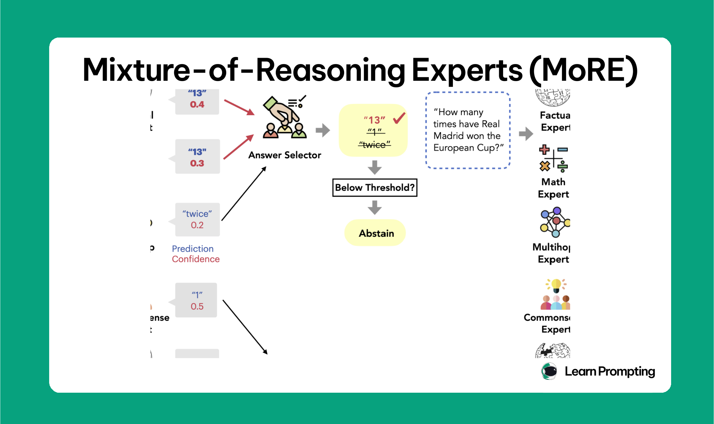
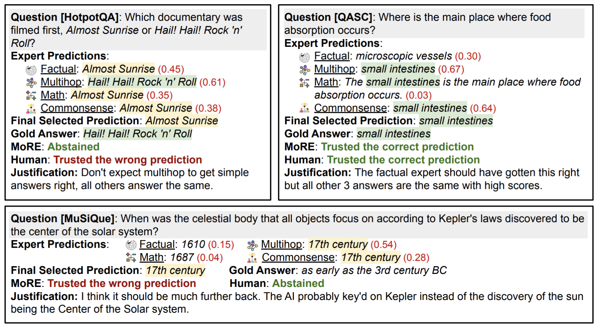
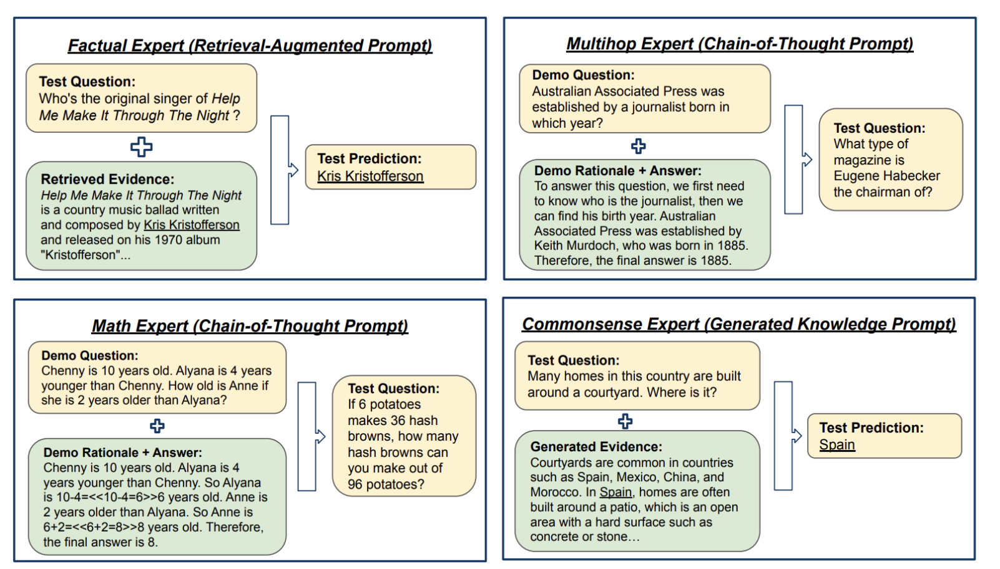
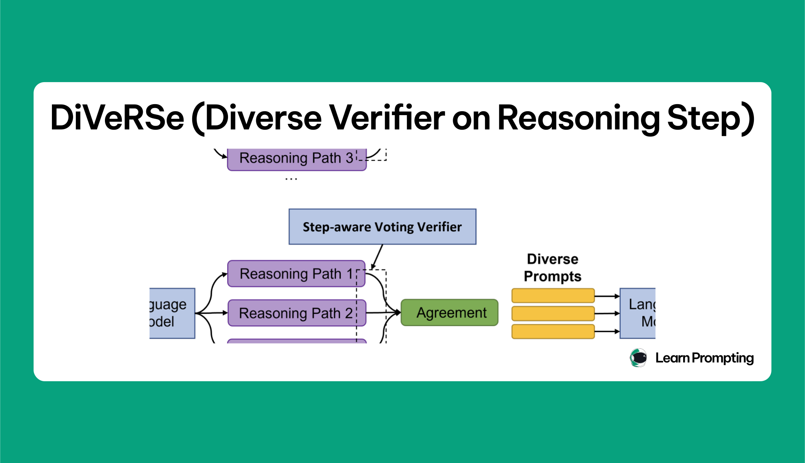
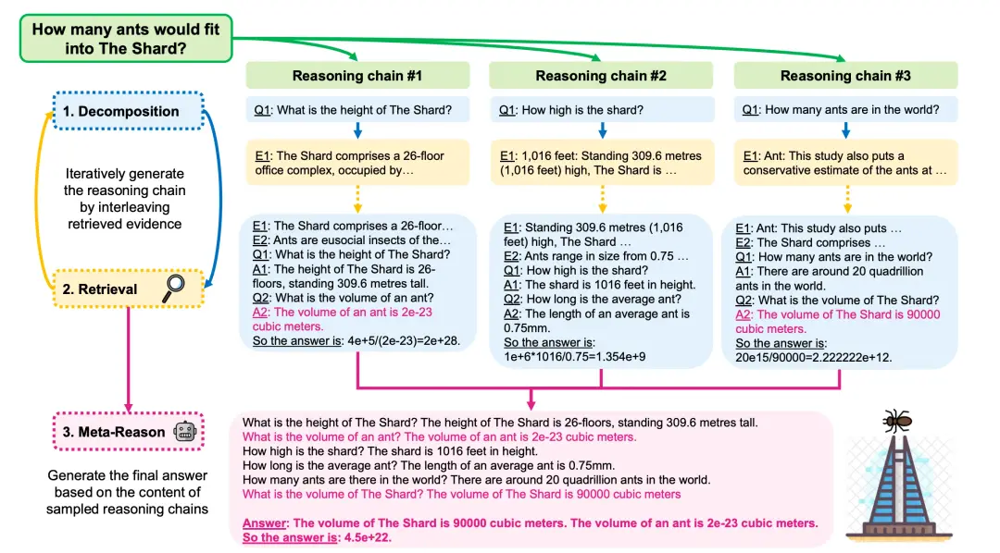
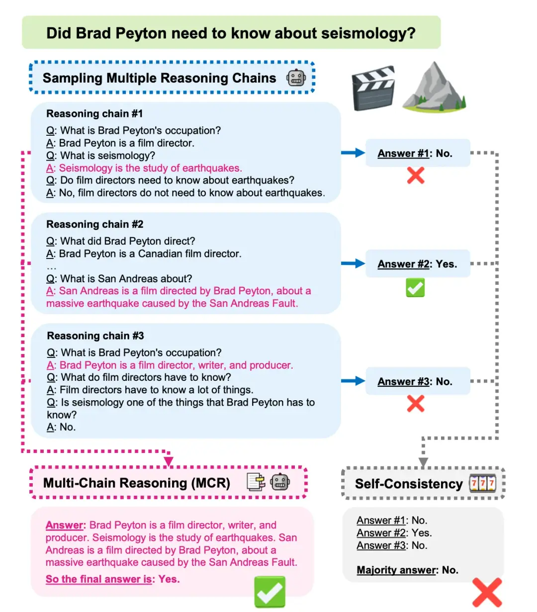
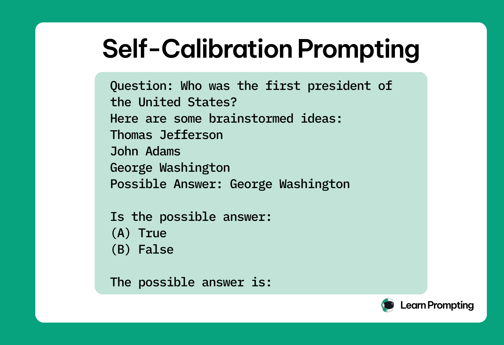

# 1️⃣ Ensembling

## `1.` Mixture of Reasoning Experts (MoRE)

🔗 Link [Mixture of Reasoning Experts (MoRE)](https://learnprompting.org/docs/advanced/ensembling/mixture_of_reasoning_experts_more)



> ***This technique uses different LLMs (differently prompted LLMs) which are expert in different things, and then combines their answers to get a better answer.***

### There are generaly differnt types, but to understand:

1. Factual reasoning (e.g., fact-based questions).
2. Multihop reasoning (e.g., questions that require multiple steps of reasoning).
3. Mathematical reasoning (e.g., solving math word problems).
4. Commonsense reasoning (e.g., questions requiring implicit knowledge).

> MoRE uses an **answer selector** to choose the best response based on predictions from the specialized experts.

> If the system detects that none of the answers are reliable, it can abstain from answering. Another key feature of MoRE is its ability to abstain from answering when it's unsure, improving the system's reliability.

### 🖼️ Visualizing the MoRE Architecture

1. **Expert Specialization & Reasoning** <br>
   

---

2. **Answer Selection & Final Output** <br>
   

## `2.` DiVerSe (Diverse Verification on Reasoning Steps)

🔗 Link [DiVerSe (Diverse Verification on Reasoning Steps)](https://learnprompting.org/docs/advanced/ensembling/diverse_verifier_on_reasoning_step)



#### What it is (1-liner)
- DiVeRSe = “Don’t trust one answer; generate multiple reasoning paths, score them with a verifier, verify steps, then pick the best via weighted voting **of the steps themselves**.”

#### Why you’d use it (real shit)
- LLMs screw up multi-step logic (math, invoices, rules, transformations), DiVeRSe reduces those dumb errors by competing multiple solutions and filtering.
- It gives you *diagnostics*: which step broke, not just “answer wrong.”

#### Components (remember these 3)
- Diverse prompts: different prompt templates force different reasoning paths.   
- Voting verifier: scores each full reasoning path as “likely correct,” then uses weighted voting instead of majority.
- Step-aware verification: checks each step independently to find where the chain goes wrong.

#### How it runs (chronological, per request)
1. Choose M1 prompt variants randomly for the same question/task.
2. For each prompt, sample M2 reasoning paths using sampling decoding (this is where randomness lives).
3. You now have $ (M = M1 \times M2 )$ candidate paths for the same question.
4. Run the voting verifier to score each path’s correctness probability.
5. Run step-aware verifier to check each step (subtraction, lookup, unit convert, etc.) and spot the failure step.
6. Do weighted voting using verifier scores to select the final answer.

## `3.` Multi Chain Reasoning (MCR)

🔗 Link [Multi Chain Reasoning (MCR)](https://learnprompting.org/docs/advanced/ensembling/multi-chain-reasoning)





**So**, this would **sound basically the same as Self-Consistency (SC)**, but it's **not**.

**The difference is that MCR keeps the intermediate reasoning steps and uses them to construct a unified explanation, while SC only keeps the final answers.**

# 2️⃣ Self-Criticism

**Main guys we will discuss here are:**
1. ⚖️ **Self-Calibration** prompts LLMs to evaluate their own responses, helping them spot mistakes and reduce false positives and negatives.

2. 💎 **Self-Refine** lets LLMs iteratively improve their initial answers, step by step, to enhance both accuracy and quality.

3. 🔄 **Reversing Chain-of-Thought (RCoT)** helps models detect hallucinations by comparing the original problem with a newly reconstructed version.

4. ✅ **Self-Verification** improves accuracy by generating multiple solutions and testing them against hidden portions of the original question.

5. 🔍 **Chain-of-Verification (CoVe)** refines responses by having the model ask and answer verification questions to critique and improve its output.

6. 🧱 **Cumulative Reasoning (CR)** breaks down complex tasks into smaller steps, refining each one until a solid solution is reached.

## `1.` Self-Calibration

🔗 Link [Self-Calibration](https://learnprompting.org/docs/advanced/self_criticism/self_calibration)




### PROMPT
```markdown
Question: Who was the first president of the United States?
Proposed Answer: George Washington
Is the proposed answer:
 (A) True
 (B) False
The proposed answer is:
```

**I think this is stupid**, I just stops after saying True of False. What if the answer is `False`? We will need to perform further steps, right? 

But for the sake of initial self-critique, this is a good start.

## `2.` Chain of Density (CoD) (🔥🔥)

🔗 Link [COD](https://learnprompting.org/docs/advanced/self_criticism/chain-of-density)

**This is aimed at the summarization** related tasks.
- The problem is -- in the single go the model does the summarization, but misses the important information.
- This prompting technique is used to **increase the density of information** in the summary by **iteratively adding more information** to the summary.

### So basically,
1. **Step 1**: Generate an initial sparse summary with 1-3 entities.
2. **Step 2**: Identify 1-3 missing informative entities from the source.
3. **Step 3**: Fuse new entities into the summary while keeping the length fixed (repeat 5x).

### PROMPT
```markdown
Article: [ARTICLE]

You will generate increasingly concise, entity-dense summaries of the above Article. Repeat the following 2 steps 5 times.

Step 1. Identify 1-3 informative Entities (";" delimited) from the Article which are missing from the previously generated summary.

Step 2. Write a new, denser summary of identical length which covers every entity and detail from the previous summary plus the Missing Entities.

A Missing Entity is:
 - Relevant: to the main story.
 - Specific: descriptive yet concise (5 words or fewer).
 - Novel: not in the previous summary.
 - Faithful: present in the Article.
 - Anywhere: located anywhere in the Article.
 

Guidelines:
 - The first summary should be long (4-5 sentences, ~80 words) yet highly non-specific, containing little information beyond the entities marked as missing. Use overly verbose language and fillers (e.g., "this article discusses") to reach ~80 words.
 - Make every word count: re-write the previous summary to improve flow and make space for additional entities.
 - Make space with fusion, compression, and removal of uninformative phrases like "the article discusses".
 - The summaries should become highly dense and concise yet self-contained, e.g., easily understood without the Article.
 - Missing entities can appear anywhere in the new summary.
 - Never drop entities from the previous summary. If space cannot be made, add fewer new entities.
 

Remember, use the exact same number of words for each summary.

Answer in JSON. The JSON should be a list (length 5) of dictionaries whose keys are "Missing_Entities" and "Denser_Summary".
```

